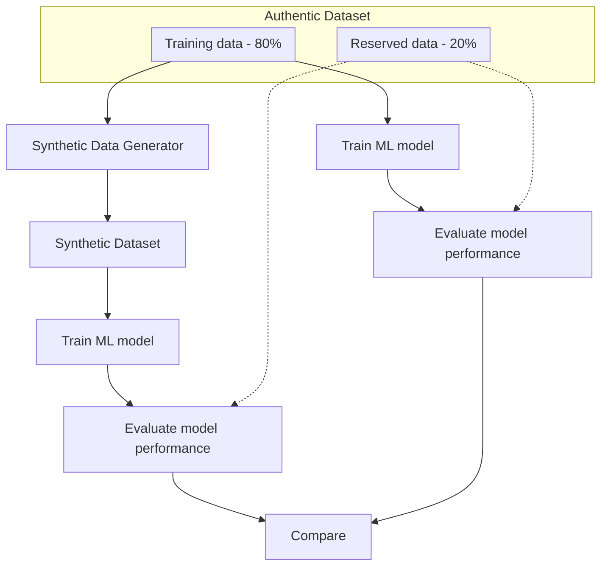

# SyntheticData

Getting access to good data for model development and testing is almost always a challenge especially when the data is sensitive or includes personally identifiable information (PII).  Attempts to preserve privacy through anonymization techniques such as hashing, masking, and even noise obfuscation are sometimes insufficient.  The [attack on the Netflix Prize dataset](https://arxiv.org/pdf/cs/0610105.pdf) and studies looking at [limitations of current methods used for protecting health care data](https://www.semanticscholar.org/paper/Practicing-Differential-Privacy-in-Health-Care%3A-A-Dankar-Emam/65a537c9cd327c2925676f59ddffa01cf4afbe51) demonstrate just how difficult privacy preservation is.  Even when sensitive and/or identifying variables are removed from the dataset, other variables can act as identifiers when they are combined.

Despite being around for a long time, synthetic data is enjoying a renaissance given the ever-growing need for realistic data.  And since synthetic data is algorithmically generated with machine learning techniques and never directly based on actual real events or individuals, a high degree of privacy can be assured.

## Getting Started

The [Lending Club dataset](https://www.kaggle.com/datasets/wordsforthewise/lending-club) is used in the notebook for demonstration.  However, you are free to use other datasets and adapt the code as appropriate.

Other datasets to consider:
* [Credit Card Transactions](https://www.kaggle.com/datasets/mlg-ulb/creditcardfraud)
* [Traffic Violations in Maryland County](https://www.kaggle.com/datasets/rounak041993/traffic-violations-in-maryland-county)
* [Airline Passenger Satisfaction](https://www.kaggle.com/datasets/teejmahal20/airline-passenger-satisfaction)

## Evaluation Approach
Synthetic data can be evaluated against the authentic data based on three fundamental dimensions:
* Statistical proximity
* Privacy preservation
* Usefulness / utility

A high-level workflow to evaluate a synthetic dataset's ability to behave the same as the authentic dataset when used to build ML models:

